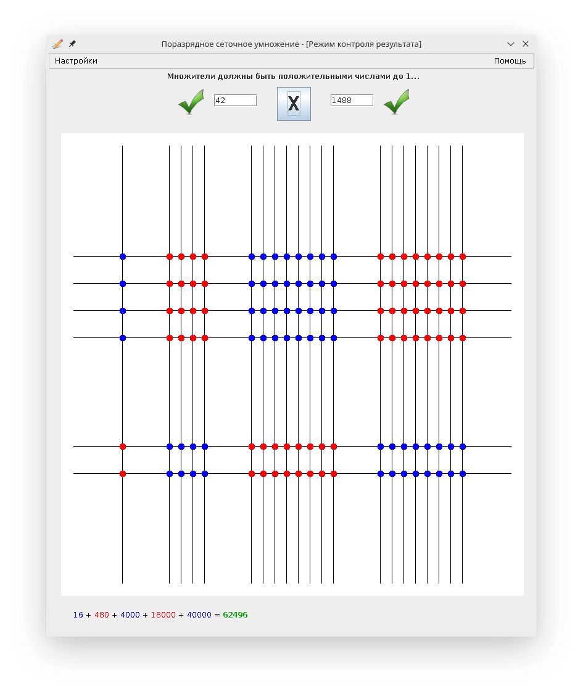

# Wellegor

Demonstration tool for a method of visual multiplication.
Written circa 2013 (I was 15 years old).

## Running

#### Windows:

Just use the provided executable, or

    > java -jar Wellegor_1.2.1.jar
    
#### Unix:

    $ java -Dfile.encoding=cp1251 -jar Wellegor_1.2.1.jar 
